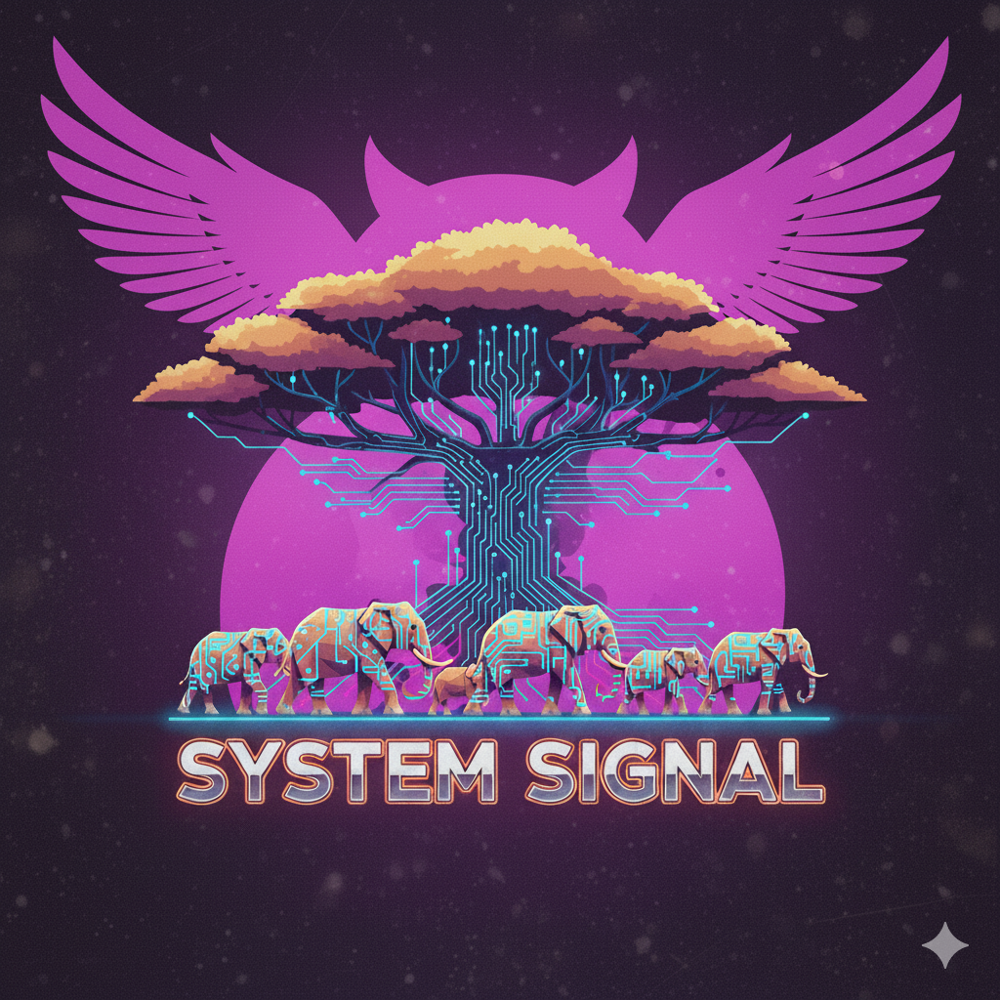

# 🛰️ System Signal

> *“Where system design, enterprise architecture, and product strategy converge.”*

---

## 📖 Overview

**System Signal** is the personal portfolio and knowledge base of **Karthik Mohan**.  
It brings together **enterprise architecture frameworks (TOGAF, LeanIX, ArchiMate)**,  
**system design clarity**, and **product lifecycle leadership (OKRs, KPIs, JTBD)**.  

This repository powers the site → [systemsignal.dev](https://systemsignal.dev)

---

## 🧭 What You’ll Find

### 🏠 Core Pages
- **[Home](/index.md)** → Positioning & featured work  
- **[About](/about.md)** → Professional identity & career journey  
- **[Projects](/projects.md)** → Enterprise platforms, independent systems, blueprints  
- **[Signal Stack](/signalstack.md)** → Case studies with TOGAF/LeanIX frameworks  
- **[Blueprints](/blueprints.md)** → Fictional but feasible system designs  
- **[Philosophy](/philosophy.md)** → Leadership principles & operating philosophy  
- **[Thesis](/thesis.md)** → The strategic manifesto of System Signal  
- **[Library](/library.md)** → Curated references (EA, Product, Systems)  
- **[Writing](/writing.md)** → Essays, case studies, and speculative systems  

### 🛠 Utility Pages
- **[Consulting](/consulting.md)** → Services, advisory, and workshops  
- **[Contact](/contact.md)** → Direct channels & Calendly booking  
- **[Links](/links.md)** → Quick hub for profiles & documents  

---

## 🌐 Profiles & Contact

- 🌐 Website → [systemsignal.dev](https://systemsignal.dev/)  
- 💼 LinkedIn → [linkedin.com/in/karthik-m-portfolio](https://www.linkedin.com/in/karthik-m-portfolio/)  
- 💻 GitHub → [github.com/elkarto91](https://github.com/elkarto91)  
- 🧵 Twitter/X → [@chaingopher](https://twitter.com/chaingopher)  
- ✉️ Email → [karthik@systemsignal.dev](mailto:karthik@systemsignal.dev)

---

## 🧬 Philosophy in Short

- **Clarity scales, ambiguity decays**  
- **Trust is infrastructure, not decoration**  
- **Products prove — they don’t just claim**  
- **Governance is leadership**  
- **Metrics measure, meaning guides**  

---

## 📜 License

This repository hosts the **System Signal site**.  
All essays, projects, and blueprints are authored by **Karthik Mohan**.  
For inquiries about re-use or collaboration → [Contact Me](/contact.md).
